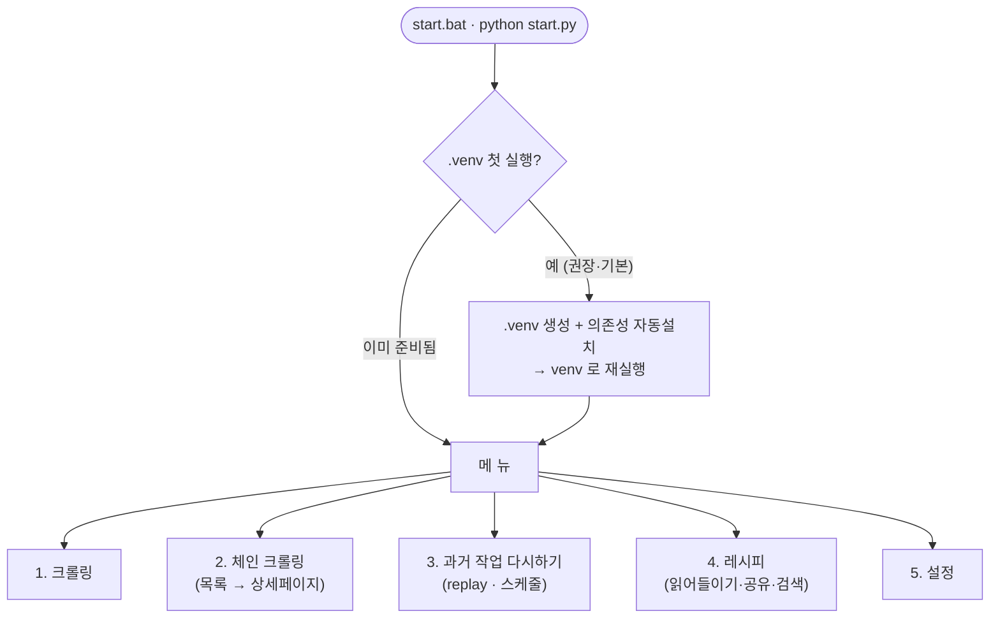
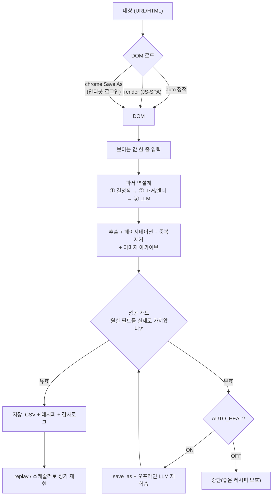

# Sovereign-Scraper

**데이터 주권을 위한 자가 치유형 웹 스크래퍼**
*Self-Healing Web Data Extraction Engine*

[](https://www.gnu.org/licenses/agpl-3.0)

## 📺 실제로 보기 (짧은 데모)

| 1. 예시 값으로 웹 스크래핑하기 | 2. 저장한 작업 재현하기 |
| :---: | :---: |
| [](https://www.youtube.com/watch?v=tdjkJWvwg5s) | [](https://www.youtube.com/watch?v=1F7CiudHOuk) |
| *코드 없이 클릭·타이핑만으로 자동 파싱* | *규칙·코드 없이 한 번 클릭으로 재현* |

---

> **⚠️ 우회(bypass) 프로그램이 아닙니다.** 이 도구의 모든 수집 경로(정적 fetch → 헤드리스 렌더 → 내 진짜
> 크롬 `Save As`)는 어디까지나 **내 브라우저·내 계정이 이미 접근할 수 있는 범위**만 가져옵니다 — 사이트의
> 봇 탐지·캡차·접근 제어를 뚫도록 설계된 기능은 없습니다. 사이트가 자동 수집을 막으면 그건 우회할 장애물이
> 아니라 그 사이트의 결정으로 받아들여야 합니다. 이 도구는 내 실제 로그인 세션(진짜 크롬)까지 구동할 수
> 있는 만큼, 자동 수집을 원치 않는 사이트에 오남용하면 계정 정지·약관 위반·법적 책임 등 실질적 위험이
> 따릅니다 — 그 책임은 이 프로젝트가 아니라 사용자 본인에게 있습니다.

> 🇰🇷 한국어 | [🇺🇸 English](README.md)

> **이 프로젝트는 AGPL-3.0 라이선스를 따릅니다.** > 본 기술을 사용하여 네트워크 서비스를 제공하거나 배포하는 경우, 수정한 전체 소스 코드를 반드시 공개해야 합니다.

> 셀렉터를 짜지 않습니다. **화면에서 본 값 한 줄**만 주면, 그 사이트의 목록을 표(CSV)로 뽑아 줍니다.
> 사이트가 구조를 바꿔도 스스로 고치고(self-heal), 한 번 성공하면 입력 없이 반복·스케줄 재현합니다.
> 로컬 우선(내 PC의 `.venv`·로컬 LLM 선택), 내 레시피·내 데이터를 내가 소유 — 그래서 *Sovereign*.

---

## 빠른 시작 (비전공자용)

1. 이 폴더의 **`start.bat` 을 더블클릭** (또는 터미널에서 `python start.py`)
2. 첫 실행이면 묻습니다 → **"가상환경(.venv)을 만들까요? (권장)"** → **Enter**
   · 필요한 것들(파이썬 패키지 + 브라우저)을 **자동 설치**합니다. 처음 한 번만, 몇 분 걸립니다.
3. 메뉴가 뜨면 **`1. 크롤링`** → 주소를 붙여넣고 → 화면에서 본 값 한 줄을 입력
   ```
   값 입력 예:  [삼성] 7월 행사 알바 모집@#12,000@#강남구 삼성동
   → 제목 / 가격 / 지역 필드를 자동으로 알아내 전체 목록을 CSV 로 추출
   ```
4. 결과는 **`output/`**, 재현용 레시피는 **`recipes/`** 에 쌓입니다.

> 필요한 것: **Python 3.10+** 만 있으면 됩니다. 나머지(lxml·Playwright·크롬)는 첫 실행이 알아서 깔아줍니다.

> **언어**: 화면 기본 언어는 **영어**입니다. 한국어로 보려면 메뉴 **`5. 설정`** 에서 언어를 `ko` 로 토글하거나,
> `.env` 에 `LANG=ko` 를 추가하세요. (내부 소스 문자열은 한국어이며, 번역이 없는 문구는 자동으로 한국어로 표시됩니다.)

---

## 무엇을 하나 — 한눈에



**핵심 크롤 흐름** (사이트별 하드코딩 없음):



> 전체 다이어그램(레지스트리·배포 구조 포함)은 **[`_internal/docs/flowchart.md`](_internal/docs/flowchart.md)**,
> 상세 요구사항은 **[`_internal/SRS.md`](_internal/SRS.md)**.

---

## 주요 기능

| | 설명 |
|---|---|
| **예시 기반(by-example)** | 셀렉터 없이, 본 값 한 줄로 추출 규칙 자동 생성 |
| **자가 치유** | 클래스 난독화·구조 변경에도 구조 경로/마커로 계속 동작, 깨지면 LLM이 그 부분만 재인식 |
| **3종 로드 자동** | `auto`(정적) / `render`(JS-SPA) / `chrome`(안티봇·로그인 Save As) — 사이트별 자동 판단·기억 |
| **안티봇·로그인 대응** | 내 진짜 크롬 세션(쿠키·로그인) 재사용. 차단 감지 시 자동 전환, 1페이지·재시도 없음 |
| **이미지 필드** | 레코드별 대표 이미지를 구조로 매칭 → **원격 URL + 오프라인 사본** 둘 다 보관 |
| **누적·재현·감사** | CSV 누적(4종 저장방식) · 레시피(CSV) 재현 · `_runs.csv` 감사 · `replay` 일괄 재현 |
| **체인 크롤링** | 목록 CSV의 링크 열 → 각 상세페이지를 단일 레코드로 2차 수집 |
| **성공 가드** | "원한 필드를 실제로 가져왔나"를 다층 검증 → 인증창·빈 페이지를 성공으로 오인 저장하지 않음 |
| **자동 재학습(선택)** | 값싼 방법이 다 실패하면 save_as HTML을 오프라인 LLM이 통째 분석해 재발견(라이브 추가접속 0) |
| **레시피 공유** | 받은 레시피(inbox)를 매니페스트로 확인 후 내 URL에 적용, 내 레시피는 마스킹해 outbox로 공유 |
| **다국어(i18n)** | 화면 문구를 한국어/영어로 전환(설정 메뉴, 기본=영어). 미번역 문구는 한국어로 자동 폴백 |

---

## 메뉴 안내

| 번호 | 기능 |
|---|---|
| **1. 크롤링** | URL/HTML 한 페이지·목록. 로드/저장 방식·주소·(있으면)재학습까지 안내 |
| **2. 체인 크롤링** | 목록 CSV의 링크를 따라 상세페이지까지 2단계 수집 |
| **3. 과거 작업 다시하기** | 성공했던 크롤링을 번호로 골라 입력 없이 재현 → 윈도우 스케줄러로 정기화 |
| **4. 레시피** | `읽어들이기`(받은 레시피를 내 URL에 적용·실행) / `공유하기`(마스킹 후 업로드) / `온라인에서 찾기`(레지스트리 검색) |
| **5. 설정** | LLM 공급자 · 저장/로드 기본값 · 언어(ko/en) · (개발자용) 정합성 점검·역량 매트릭스 |

---

## 레시피 공유 — 파일이 아니라 "검증된 안내서"를 주고받기

공유 레시피는 통째 이식하는 파일이 아니라, **누군가 검증한 필드맵 안내서**입니다. 받으면 내 URL로 데려가
그대로 적용하거나 내 방식대로 다시 만들 수 있고, 적용하면 **내 실행기록·내 레시피가 남아** 바로 재현됩니다.

- **폴더 분리**: `recipes/shared/outbox`(내가 보낼 마스킹본) · `recipes/shared/inbox`(받은 것)로 나뉘어 섞이지 않습니다.
- **자기설명 이름**: 공유 파일명이 `사이트_필드1_필드2…`(예: `google_이메일제목_이메일내용`) — 열어보지 않아도 무엇인지 압니다.
  공유할 때 `Enter=기본 이름` 또는 직접 입력.
- **읽어들이기**: inbox 목록에서 고르면 **사이트·필드(매니페스트)** 를 보여주고 → 내 URL 입력 →
  `Enter=검증된 레시피 그대로 적용·실행` / `아무거나 입력=처음부터 새로 만들기`.
  적용은 곧 한 번의 실행이라 `_runs.csv` 기록과 내 레시피가 생겨 **"받았는데 뭘 해야 하지?"** 가 사라집니다.
- **올리기**: 자동 업로드하지 않습니다(프라이버시). 검색어를 **마스킹**해 outbox로 뽑은 뒤, 브라우저로 업로드
  페이지를 열어 **사람이 검수해 PR로 제출**합니다. `온라인에서 찾기`로 공개 레지스트리를 검색해 inbox로 받을 수 있습니다.

> 온라인 검색/받기는 기본값이 이미 이 프로젝트 자신(`recipes/shared/registry/`)을 가리켜서 별도 설정
> 없이 바로 동작합니다. 자기 fork 로 별도 레지스트리를 운영하고 싶다면 `.env` 에서 덮어쓰세요
> (`.env.example` 참고):
> ```
> RECIPE_REGISTRY_RAW=https://raw.githubusercontent.com/<계정>/<내 fork>/main/recipes/shared/registry/
> RECIPE_REGISTRY_WEB=https://github.com/<계정>/<내 fork>
> ```

---

## 프라이버시 / 데이터 주권

- **로컬 우선**: 격리된 `.venv`, 결과·레시피는 내 PC에. LLM은 **선택**이며 미연결 시 구조/휴리스틱으로 동작
  (로컬 LM Studio·Ollama, 또는 OpenAI 호환 클라우드 중 택1).
- **자동 push 없음**: 공유는 언제나 *마스킹 → 사람 검수 → PR*. 내 검색어가 그대로 새지 않습니다.
- **탐지 최소화**: 차단 사이트는 1페이지·자동 재시도 없음. 무거운 분석은 로컬에 받아둔 HTML로만.

---

## 폴더 구조

```
Sovereign-Scraper/
├─ start.bat / start.py      ← 여기서 시작
├─ cli.py  replay.py          ← 파워유저용 진입점
├─ output/                    ← 결과 CSV·이미지
├─ recipes/                   ← 재현용 레시피 (shared/outbox=내가 공유할 것 · shared/inbox=받은 것)
├─ requirements.txt  .env      ← 의존성·설정
└─ _internal/                 ← 엔진 내부(engine·crawlers·core·tests·docs 등, 손대지 않아도 됨)
```

폴더를 옮겨도 동작합니다(데이터의 경로는 루트 기준 상대 저장 + 읽을 때 재-앵커).

---

## 요구사항 / 설치

첫 실행이 `.venv` 로 자동 설치하지만, 수동으로 하려면:

```bash
pip install -r requirements.txt
python -m playwright install chromium     # 렌더/피커/Save As 용 (최초 1회 ~150MB)
```

| 패키지 | 필수 | 용도 |
|---|---|---|
| lxml | ✅ | HTML 파싱(코어) |
| playwright | ✅ | JS 렌더·시각적 피커 (+ chromium) |
| pywin32 | Windows | 내 크롬 Save As 자동화 |
| requests | 선택 | 없으면 표준 urllib로 폴백 |

LLM은 OpenAI 호환 REST를 직접 호출(별도 SDK 불필요). 설정은 메뉴 `5. 설정 → LLM 공급자`.

---

## 파워유저 (CLI) & 개발

```bash
python cli.py "<URL>" --example "제목@#12,000@#강남구"   # 예시로 바로 추출
python cli.py "<URL>" --pages 5                           # 5페이지 순회
python cli.py "<무한스크롤 URL>" --scroll                  # 끝까지 스크롤
python replay.py all                                     # 저장된 성공 크롤 전부 재현(스케줄러용)
```

전체 CLI 옵션·검증 사이트·아키텍처는 **[`_internal/SRS.md`](_internal/SRS.md)** 부록 참조.

```bash
python _internal/tests/run_tests.py     # 전체 테스트 (현재 254개)
```

---

## 라이선스 / 책임

대상 사이트의 robots.txt·이용약관·요청 한도 준수는 **사용자 책임**입니다. 이 도구는 안정적 수집 수단을
제공하되, 차단 사이트에는 신호를 최소화(1페이지·재시도 없음)합니다. Save As 방식은 **본인 로그인 세션**으로
볼 수 있는 범위만 대상으로 하세요.
