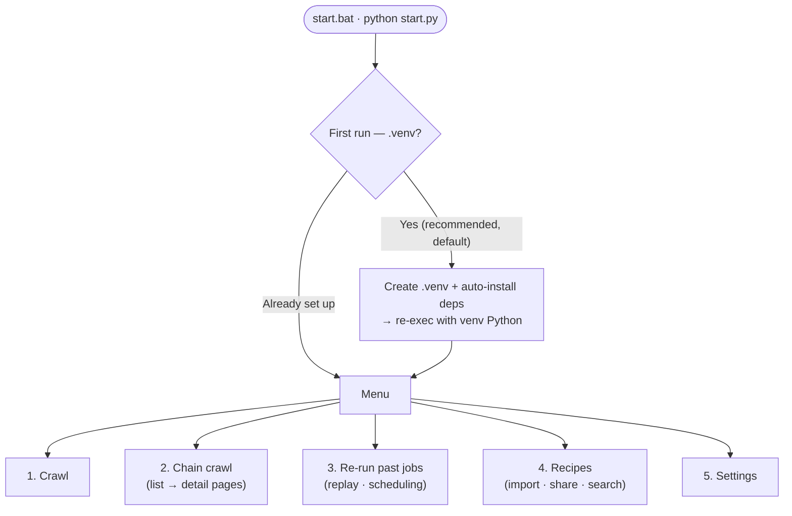
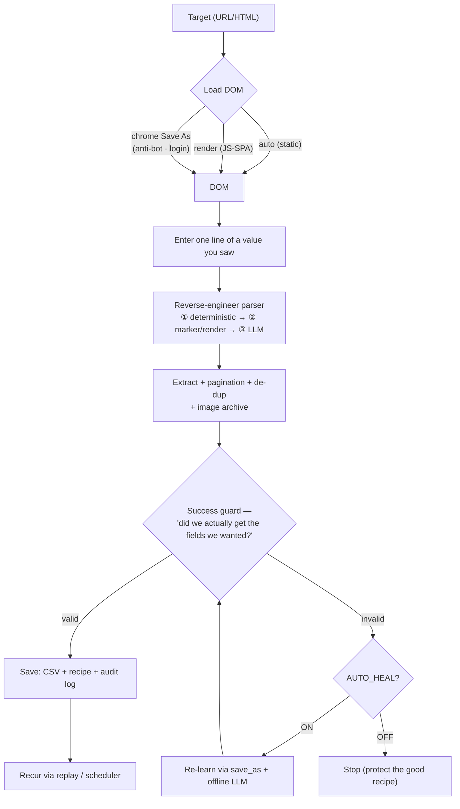

# Sovereign-Scraper

**Sovereign-Scraper is a local-first data extraction engine designed to work independently of LLMs.**
It analyzes each page's DOM directly — static fetch, headless render, or your own browser session,
whichever a site needs — creates reusable extraction recipes, and optionally uses AI for semantic
field mapping and self-healing.

[](https://www.gnu.org/licenses/agpl-3.0)

## 📺 See It In Action (Quick Demos)

| 1. Web Scraping by Example | 2. How to Replay Any Task |
| :---: | :---: |
| [](https://www.youtube.com/watch?v=tdjkJWvwg5s) | [](https://www.youtube.com/watch?v=1F7CiudHOuk) |
| *No-Code Visual Picker & Auto-Parsing* | *1-Click Replay Without Rules or Code* |

---

> **⚠️ Not a bypass tool.** Every load path here (static fetch → headless render → your real Chrome
> `Save As`) only reaches what your own browser/account can already reach — none of it is designed to
> defeat a site's bot-detection, CAPTCHA, or access controls. If a site blocks automated access, treat
> that as the site's decision, not an obstacle to route around. Because this tool can also drive your
> real, logged-in Chrome session, misusing it against sites that don't want automated access carries
> real risk (blocked account, ToS violation, legal exposure) — that risk is yours, not this project's.

> [🇺🇸 English](README.md) | 🇰🇷 [한국어](README.ko.md)

> **This project is licensed under AGPL-3.0.** If you use this technology to provide or deploy a network
> service, you must make the complete modified source code publicly available.

> No selectors to write. Give it **one line of a value you saw on screen**, and it turns that site's list
> into a table (CSV). When the site changes structure, it heals itself — and once a crawl succeeds, it
> repeats or schedules it without any further input. Local-first (your own `.venv`, choice of local LLM),
> your recipes and your data stay yours — hence *Sovereign*.

---

## Quick Start (no coding required)

1. **Double-click `start.bat`** in this folder (or run `python start.py` from a terminal)
2. On first run it asks: **"Create a virtual environment (.venv)? (recommended)"** → press **Enter**
   · Everything needed (Python packages + browser) is **installed automatically**. One-time, takes a few minutes.
3. When the menu appears, pick **`1. Crawl`** → paste the URL → enter one line of a value you saw on screen
   ```
   Example input:  [Chelsea] Weekend event staff wanted@#$18/hr@#Chelsea, Manhattan
   → Automatically figures out the title / price / location fields and extracts the full list as CSV
   ```
4. Results land in **`output/`**, and the reusable recipe lands in **`recipes/`**.

> All you need: **Python 3.10+**. Everything else (lxml, Playwright, Chromium) is installed automatically on first run.

> **Language**: The default display language is **English**. To switch to Korean, toggle the language in the
> menu (**`5. Settings`**), or add `LANG=ko` to `.env`. (Source strings are Korean internally; any phrase
> without an English translation yet falls back to Korean automatically.)

---

## What it does — at a glance



**Core crawl flow** (no per-site hardcoding):



> The full diagram (registry, deployment structure included) is at
> **[`_internal/docs/flowchart.md`](_internal/docs/flowchart.md)**; detailed requirements are in
> **[`_internal/SRS.md`](_internal/SRS.md)** (Korean, canonical spec).

---

## Key Features

| | Description |
|---|---|
| **Programming-by-example** | No selectors — give one line of a seen value and the extraction rule is generated automatically |
| **Self-healing** | Keeps working through class-name obfuscation/structure changes via structural paths/markers; when it truly breaks, an LLM re-locates just that part |
| **3 automatic load methods** | `auto` (static) / `render` (JS-SPA) / `chrome` (anti-bot·login Save As) — decided and remembered per site |
| **Anti-bot / login handling** | Reuses your real Chrome session (cookies, login). Auto-switches on block detection, 1 page, no retries |
| **Image fields** | Picks the representative image per record by structure → keeps **both the remote URL and an offline copy** |
| **Accumulate · replay · audit** | CSV accumulation (4 save modes) · recipe (CSV) replay · `_runs.csv` audit log · bulk `replay` |
| **Chain crawling** | Follows the link column of a list CSV → collects each detail page as a single record |
| **Success guard** | Multi-layer verification of "did we actually get the fields we wanted?" — won't mistake a login wall or empty page for success |
| **Auto re-learning (optional)** | If cheap methods all fail, an offline LLM analyzes the save_as HTML wholesale to rediscover fields (zero extra live requests) |
| **Recipe sharing** | Review a received recipe (inbox) via its manifest before applying it to your URL; share your own recipes masked, via outbox |
| **Internationalization (i18n)** | Toggle the UI between Korean and English (Settings menu, default = English); untranslated strings fall back to Korean automatically |

---

## Menu Guide

| # | Function |
|---|---|
| **1. Crawl** | A single URL/HTML page or a list. Walks you through load/save method, address, and (if applicable) re-learning |
| **2. Chain crawl** | Follows links from a list CSV to collect detail pages, two-stage |
| **3. Re-run past jobs** | Pick a previously successful crawl by number and replay it with no input → schedule via Windows Task Scheduler |
| **4. Recipes** | `Import` (apply a received recipe to your URL and run it) / `Share` (mask then upload) / `Find online` (search the registry) |
| **5. Settings** | LLM provider · save/load defaults · language (ko/en) · (dev) health check, capability matrix |

---

## Recipe Sharing — trading "verified guides," not raw files

A shared recipe isn't a file you transplant wholesale — it's **a field map someone else has already verified**.
When you receive one, you take it to your own URL and either apply it as-is or rebuild it your own way. Applying
it runs the crawl once, so **your own run history and your own recipe are created** immediately.

- **Folder separation**: `recipes/shared/outbox` (masked recipes you're about to share) vs.
  `recipes/shared/inbox` (recipes you've received) — never mixed.
- **Self-describing names**: shared files are named `site_field1_field2…` (e.g. `google_email_subject_email_body`)
  — you know what it is without opening it. When sharing, `Enter = auto-generated name` or type your own.
- **Import**: pick one from the inbox list → see the **site and fields (manifest)** → enter your URL →
  `Enter = apply the verified recipe as-is and run` / `type anything = start fresh from scratch`.
  Applying is itself one run, so it creates a `_runs.csv` entry and your own recipe — no more
  "I got this, now what?" orphan state.
- **Uploading**: nothing is auto-uploaded (privacy). Your search term is **masked** into an outbox export, then a
  browser opens the upload page for **a human to review and submit as a PR**. Use `Find online` to search the
  public registry and pull recipes into your inbox.

> Online search/fetch works out of the box — it points at this project's own repo
> (`recipes/shared/registry/`) by default, no setup needed. Running your own fork with a separate
> registry? Override it in `.env` (see `.env.example`):
> ```
> RECIPE_REGISTRY_RAW=https://raw.githubusercontent.com/<account>/<your-fork>/main/recipes/shared/registry/
> RECIPE_REGISTRY_WEB=https://github.com/<account>/<your-fork>
> ```

---

## Privacy / Data Sovereignty

- **Local-first**: an isolated `.venv`; results and recipes stay on your machine. The LLM is **optional** and
  falls back to structural/heuristic matching when not connected (choose local LM Studio/Ollama, or an
  OpenAI-compatible cloud endpoint).
- **No automatic push**: sharing is always *mask → human review → PR*. Your search terms never leak as-is.
- **Minimized footprint**: blocked sites get 1 page and no automatic retries. Heavy analysis only ever runs
  against locally saved HTML.

---

## Folder Structure

```
Sovereign-Scraper/
├─ start.bat / start.py      ← start here
├─ cli.py  replay.py          ← power-user entry points
├─ output/                    ← result CSVs · images
├─ recipes/                   ← recipes for replay (shared/outbox = yours to share · shared/inbox = received)
├─ requirements.txt  .env      ← dependencies · settings
└─ _internal/                 ← engine internals (engine·crawlers·core·tests·docs, no need to touch)
```

The project still works if you move the folder (data paths are stored relative to the project root and
re-anchored on read).

---

## Requirements / Installation

The first run installs everything into `.venv` automatically. To do it manually instead:

```bash
pip install -r requirements.txt
python -m playwright install chromium     # for rendering/picker/Save As (one-time, ~150MB)
```

| Package | Required | Purpose |
|---|---|---|
| lxml | ✅ | HTML parsing (core) |
| playwright | ✅ | JS rendering · visual picker (+ chromium) |
| pywin32 | Windows | Chrome Save As automation |
| requests | optional | falls back to stdlib urllib if absent |

The LLM is called directly over an OpenAI-compatible REST API (no extra SDK needed). Configure it in
`5. Settings → LLM provider`.

---

## Power Users (CLI) & Development

```bash
python cli.py "<URL>" --example "Title@#$18/hr@#Manhattan"    # extract straight from an example
python cli.py "<URL>" --pages 5                                # walk 5 pages
python cli.py "<infinite-scroll URL>" --scroll                 # scroll to the bottom
python replay.py all                                           # replay every saved successful crawl (for schedulers)
```

Full CLI options, verified sites, and architecture are documented in the appendix of
**[`_internal/SRS.md`](_internal/SRS.md)** (Korean, canonical spec).

```bash
python _internal/tests/run_tests.py     # full test suite (currently 254)
```

---

## License / Responsibility

Compliance with a target site's robots.txt, terms of service, and request limits is **the user's
responsibility**. This tool provides a stable collection mechanism while minimizing signal to blocked
sites (1 page, no retries). Use the Save As method only for pages within the scope of **your own logged-in
session**.
