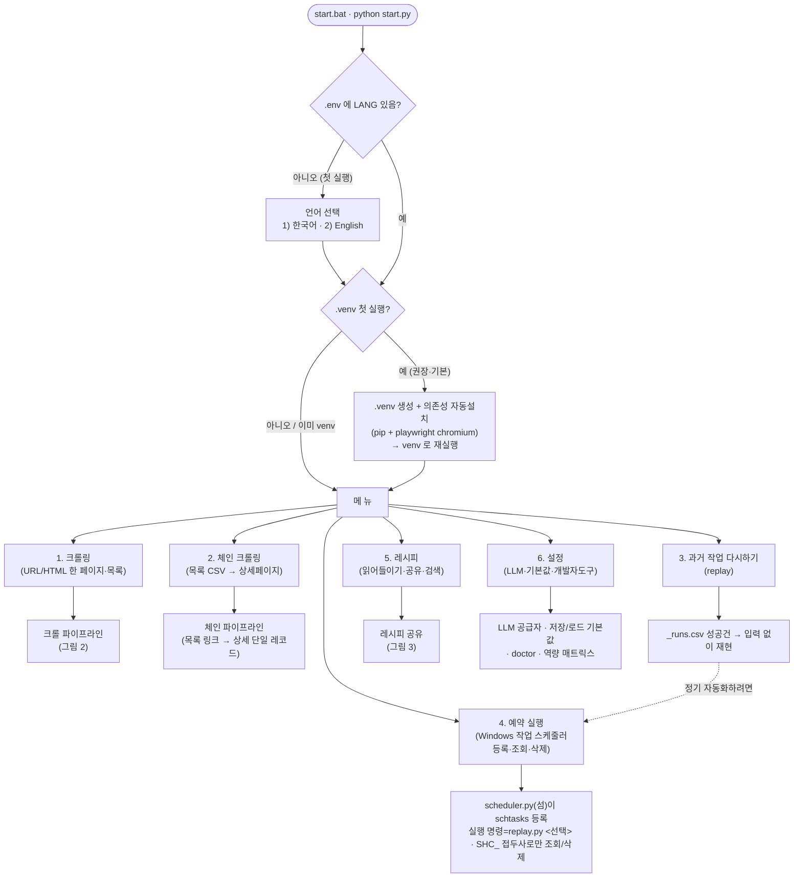
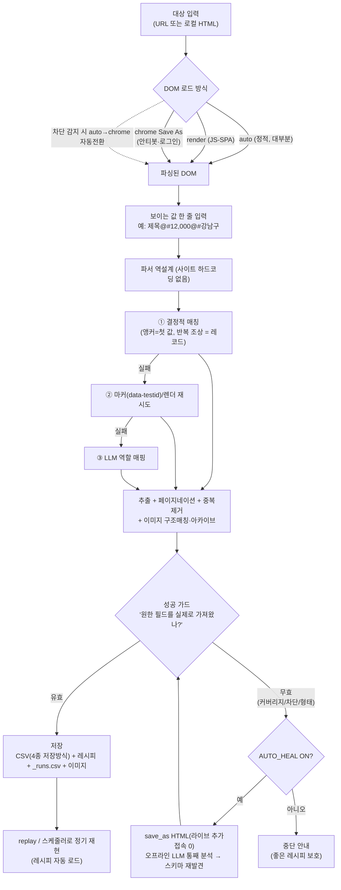
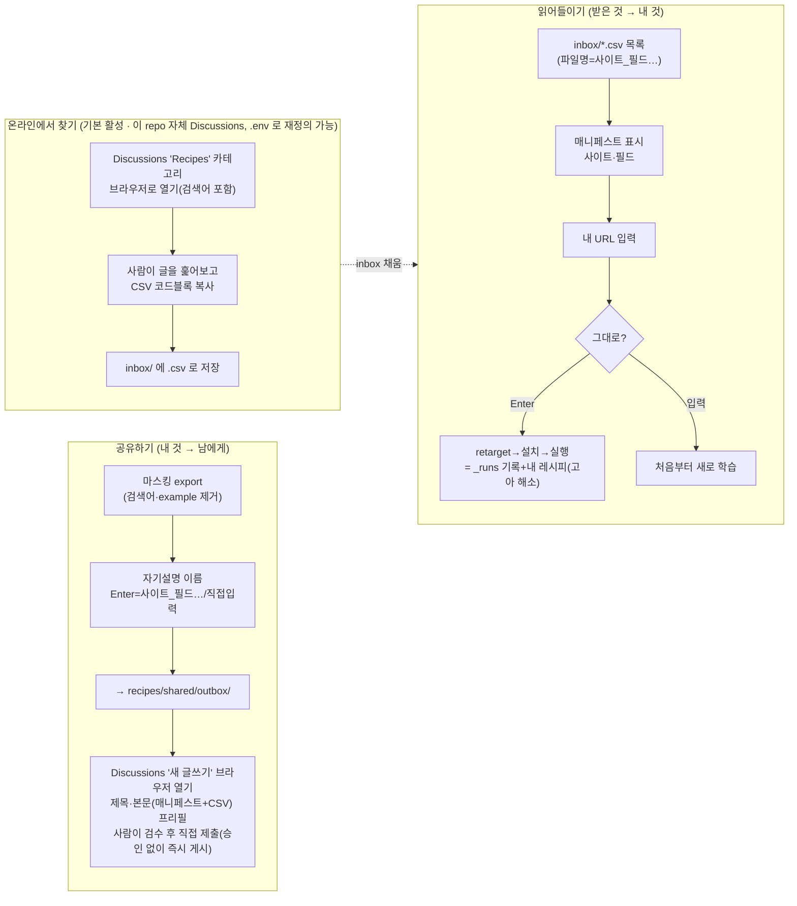
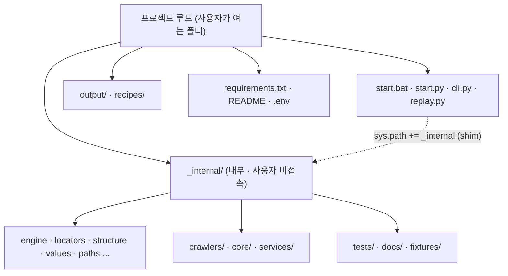
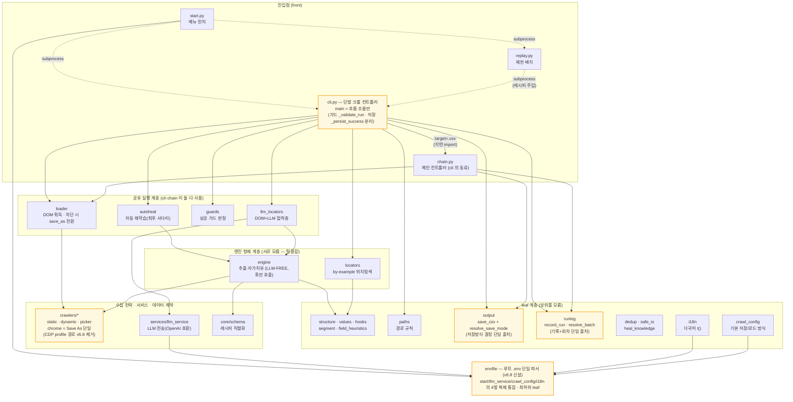

# Sovereign-Scraper — 프로그램 플로우차트

> 데이터 주권을 위한 자가 치유형 웹 스크래퍼. 아래 다이어그램은 실제 코드 흐름을 요약한다.
> (진입점 `start.py`/`cli.py`/`replay.py`, 내부 모듈은 `_internal/`.)

## 1. 최상위 흐름 — 실행 → 첫 실행(venv) → 메뉴

## 2. 핵심 크롤 파이프라인 — by-example → 자가 치유 → 저장

## 3. 레시피 공유 — 읽어들이기(inbox) / 공유하기(outbox → 게시판) / 게시판 검색

> Discussions 는 public repo 라도 API 검색에 GitHub 토큰이 필요해(무인증 원칙과 충돌) 검색은
> 브라우저를 여는 것까지만 자동화하고, 나머지(글 훑어보기·CSV 복사)는 사람이 한다.

## 4. 배포 구조 — front / _internal

## 5. 모듈 의존 구조(계층) — v6.8 전수 감사 반영

> 화살표 = import 방향(위→아래로만, 순환 없음 — 경계는 주석이 아니라 테스트가 강제).
> **노란 테두리** = v6.8 에서 신설/역할이 확대된 모듈. 세부 규율은 SRS §5-b.

> v6.8 변경 요지: ① `crawlers/chrome.py` 의 CDP profile 경로(-181줄)를 제거해 '진짜 크롬' 진입점을
> Save As 하나로 확정(부활 방지 테스트 포함). ② `.env` 파서 4벌을 `envfile`(최하위 leaf)로 통합 —
> leaf 규율이 복제를 유발하면 규율을 깨는 대신 '더 낮은 공용 leaf'를 만든다. ③ 저장방식/회차/기록
> 규칙을 `output`·`runlog` 단일 출처로 옮겨 cli·chain 중복 제거, cli.main 은 가드·저장을 함수로
> 분리해 흐름 조율만 남김.
