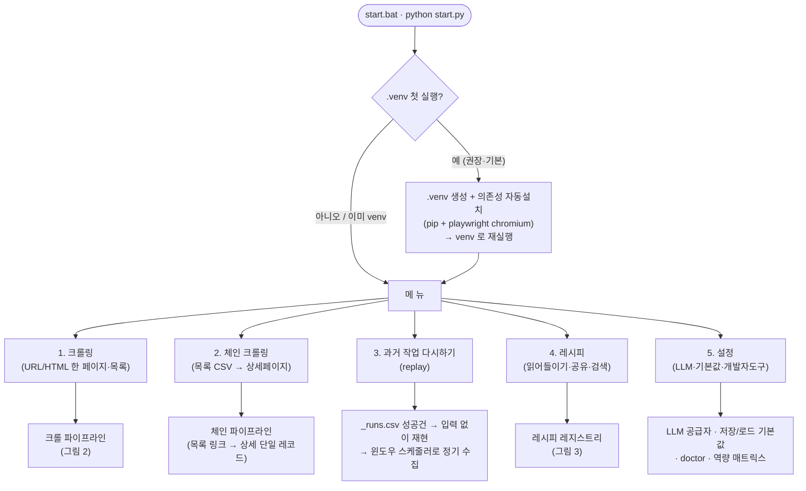
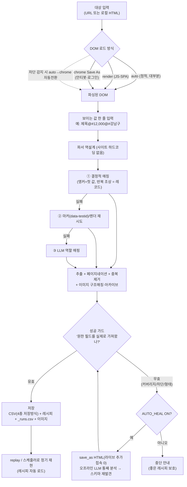
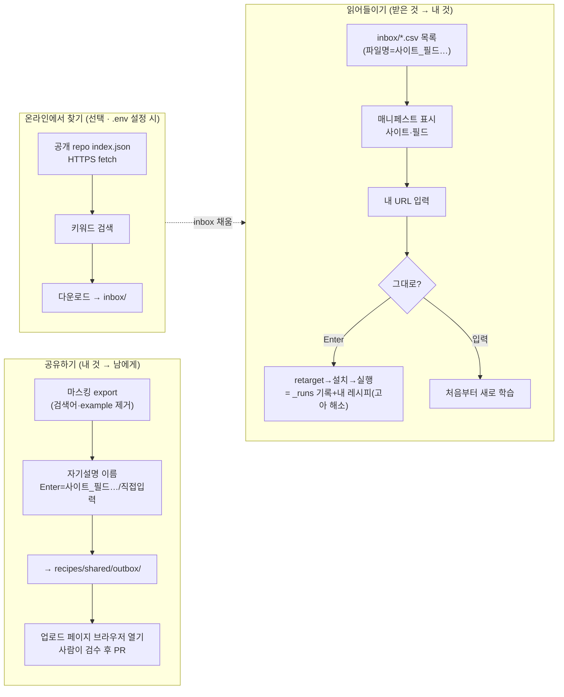
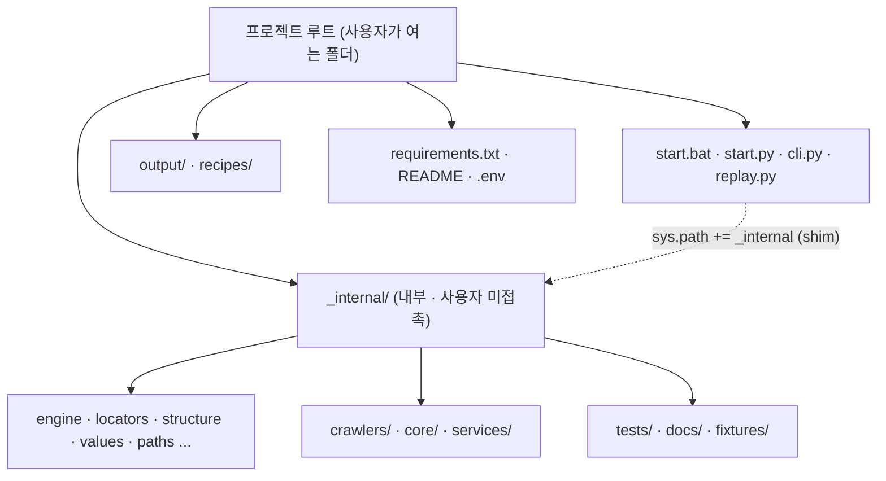

# Sovereign-Scraper — 프로그램 플로우차트

> 데이터 주권을 위한 자가 치유형 웹 스크래퍼. 아래 다이어그램은 실제 코드 흐름을 요약한다.
> (진입점 `start.py`/`cli.py`/`replay.py`, 내부 모듈은 `_internal/`.)

## 1. 최상위 흐름 — 실행 → 첫 실행(venv) → 메뉴

## 2. 핵심 크롤 파이프라인 — by-example → 자가 치유 → 저장

## 3. 레시피 공유 — 읽어들이기(inbox) / 공유하기(outbox) / 온라인 검색

## 4. 배포 구조 — front / _internal

